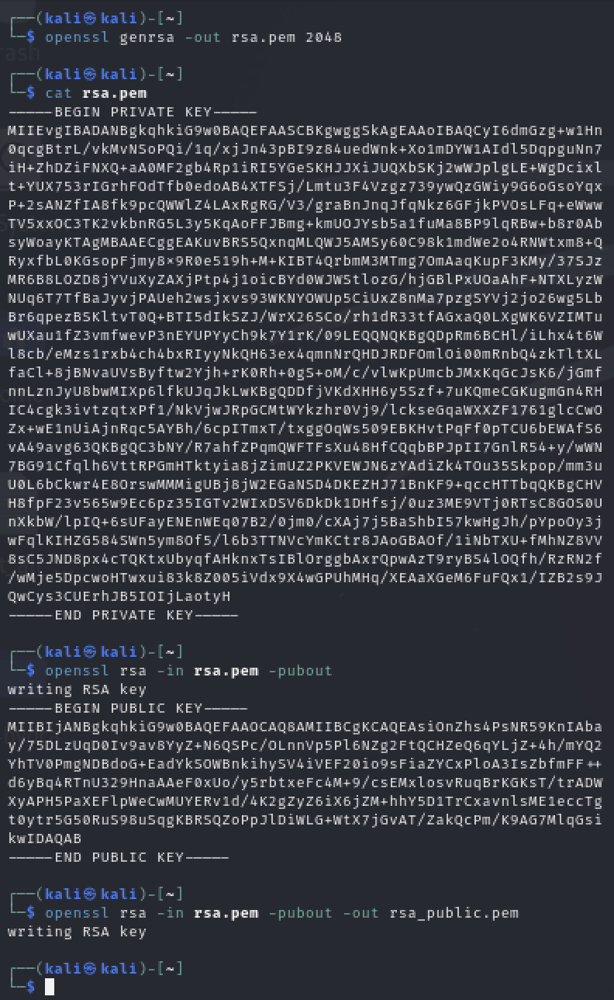
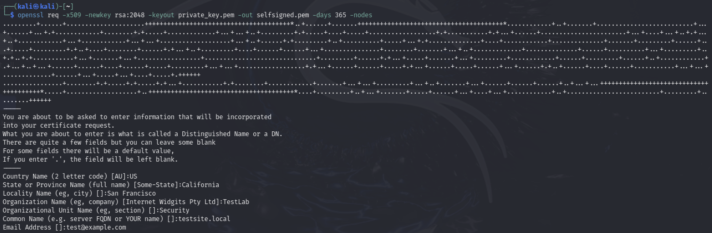

# PKI Lab - Public Key Infrastructure OpenSSL Experiments

## Overview
This repository contains hands-on experiments with Public Key Infrastructure (PKI) using OpenSSL in Kali Linux. The lab demonstrates RSA key generation, certificate operations, and encryption/decryption processes as part of cybersecurity education.

## Repository Structure
```
├── scripts/
│   ├── 01_rsa_key_generation.sh
│   ├── 02_certificate_creation.sh
│   └── 03_encryption_decryption.sh
├── screenshots/
│   ├── RSA_Key_Generation.png
│   ├── Self-Signed_Certificate_Creation.png
│   ├── View_the_certificate_details.png
│   └── Encryption_Decrypt_Demo.png
└── README.md
```

## Experiments Conducted

### Experiment 1: RSA Key Generation
- Generated 2048-bit RSA private key
- Extracted corresponding public key
- Demonstrated key pair relationship

**Key Observations:**
- RSA 2048-bit key generation completed successfully, providing current industry-standard security level
- Private key contains both public and private components in PEM format with clear BEGIN/END markers  
- Public key extraction worked correctly, showing the mathematical relationship between key pairs



### Experiment 2: Self-Signed Certificate Creation
- **Created our own X.509 self-signed certificate** using the generated RSA key pair
- Configured certificate with custom organizational details and Distinguished Name fields
- Analyzed certificate structure, validity period, and embedded public key information
- Demonstrated certificate viewing and verification capabilities

**Key Observations:**
- Self-signed certificate creation required interactive input for Distinguished Name fields
- Certificate includes all standard X.509 fields (subject, issuer, validity dates, public key)
- Generated certificate shows 365-day validity period and RSA 2048-bit public key embedded
- **Successfully created our own certificate rather than using pre-existing ones**, demonstrating full certificate lifecycle management



### Experiment 3: File Encryption/Decryption
- Encrypted plaintext message using RSA public key
- Decrypted ciphertext using corresponding private key
- Verified successful asymmetric cryptography operation

**Key Observations:**
- RSA encryption successfully converted plaintext message into binary ciphertext data
- Encrypted file size (256 bytes) matches RSA key size, demonstrating proper PKCS#1 padding
- Decryption process correctly recovered original message, proving asymmetric cryptography functionality


## Prerequisites
- Kali Linux (or any Linux distribution)
- OpenSSL 3.0+
- Basic command line knowledge

## Usage

### Quick Start
```bash
# Clone the repository
git clone [your-repo-url]
cd pki-lab

# Make scripts executable
chmod +x scripts/*.sh

# Run experiments in order
./scripts/01_rsa_key_generation.sh
./scripts/02_certificate_creation.sh  
./scripts/03_encryption_decryption.sh
```

### Individual Experiments
Each script can be run independently to demonstrate specific PKI concepts.

## Educational Value
This lab demonstrates:
- **RSA Key Management**: Generation and handling of asymmetric key pairs
- **Certificate Operations**: X.509 certificate creation and analysis
- **Practical Cryptography**: Real-world encryption/decryption workflows
- **OpenSSL Usage**: Modern cryptographic tool implementation
- **Custom Certificate Creation**: Building certificates from scratch rather than using pre-made ones

## Security Notes
- All keys and certificates in this repository are for educational purposes only
- Generated materials use test/fictitious organizational information
- Do not use these keys or certificates in production environments

## Technical Details
- **RSA Key Size**: 2048 bits (industry standard)
- **Certificate Validity**: 365 days
- **Encryption Padding**: PKCS#1 
- **Hash Algorithm**: SHA-256 (default)

## Learning Outcomes
After completing this lab, users will understand:
- How asymmetric cryptography works in practice
- The relationship between private keys, public keys, and certificates
- Basic PKI operations using industry-standard tools
- The structure and purpose of X.509 certificates
- **How to create and manage self-signed certificates from scratch**

## Acknowledgments

This lab was inspired by and builds upon concepts from **HackTheBox Academy's Public Key Infrastructure module**. While the original HackTheBox lab provided foundational PKI knowledge, this implementation required creating our own certificates and key pairs rather than using pre-existing ones, providing hands-on experience with the complete certificate lifecycle.

Special thanks to [HackTheBox Academy](https://academy.hackthebox.com/) for their comprehensive cybersecurity education resources.

------------------------------------------
Cybersecurity Lab Exercise - Educational Purpose

This project is for educational use only.
